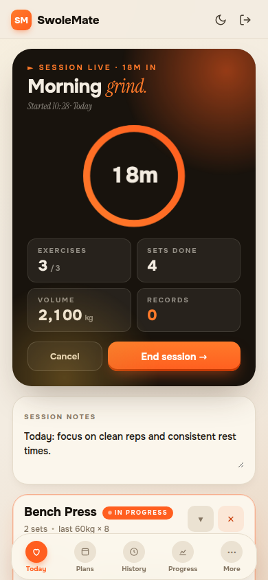
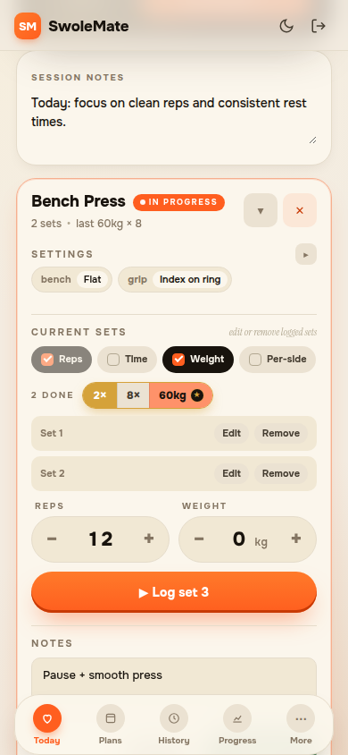
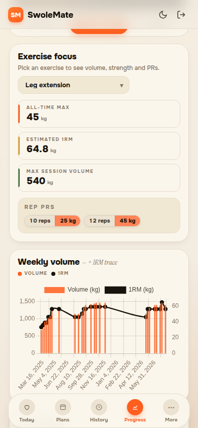
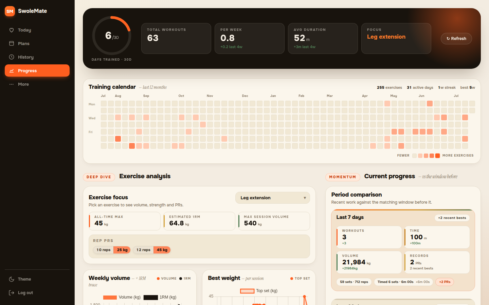

<p align="center">
  
</p>

<h1 align="center">SwoleMate</h1>

<p align="center">
  <a href="https://github.com/BattermanZ/SwoleMate/tags"></a>
  <a href="LICENSE"></a>
  <a href="server"></a>
  <a href="client"></a>
  <a href="#running-with-docker-or-podman"></a>
</p>

A self-hosted, phone-first workout logger. You train, you log sets as you go, your data stays on your own server.

SwoleMate is built for logging a session while you're actually lifting, not for filling in a spreadsheet afterward. Add an exercise, log a set, move on. It runs as a Rust API backed by SQLite and a SvelteKit PWA, both of which you run yourself.

<p align="center">
  
</p>

## Who it's for

- People who want their workout history on their own hardware, not a fitness company's cloud.
- People who log sets mid-workout on a phone and want that to be fast, not a chore.
- People comfortable running a couple of Docker/Podman containers, or building from source.

**SwoleMate is not:**
- A hosted SaaS. There is no managed instance; you run your own.
- A multi-tenant gym platform, coaching app, or social feed. It has users and an admin role, but it's built for a household, not an organization.
- A public-internet-facing app out of the box. It's designed to sit behind your own reverse proxy with HTTPS.

## Highlights

- Phone-first session logging: exercises, sets, timed sets with countdown timers, notes, per-side weights, optional equipment settings.
- Workout templates you can start from and log through one exercise at a time.
- History with full session detail, including editable start/end times, notes, and rating.
- Progress overview: recent PRs, recent bests, timed records, exercise focus, and trends, with charts.
- Optional offline logging on the Today page (local-first queue that syncs once you're back online).
- Automatic weekly backups with a retention policy, plus admin-triggered manual backups and restore.
- Admin-only user management, so one person can run it for a household without giving everyone admin rights.
- An MCP endpoint so you can connect compatible AI tools to your own data using a personal token.

## Screenshots

<table>
  <tr>
    <td width="50%" valign="top">
      
      <p align="center"><sub><b>Today</b>: logging a set</sub></p>
    </td>
    <td width="50%" valign="top">
      
      <p align="center"><sub><b>Progress</b>: strength trend + PRs</sub></p>
    </td>
  </tr>
</table>

<p align="center">
  
  <br><sub><b>Progress</b> on desktop: training calendar and exercise charts</sub>
</p>

## How it works

- You sign in with a username and password (cookie session, no third-party auth).
- You start a session, add exercises, then add sets and notes as you go.
- Marking an exercise done locks its inputs until you explicitly reopen it, so you can't accidentally edit a finished set mid-workout.
- If you forget to end a session, the server closes it automatically after 30 minutes of inactivity by default (configurable, see [Configuration](#configuration)). Auto-closed sessions are flagged so you can fix the times later.
- Everything lives in a SQLite file on your server. Backups are `.tar.gz` snapshots you can download or restore from the UI.

## Quick start

### Running with Docker or Podman

SwoleMate ships two Dockerfiles (`server/Dockerfile`, `client/Dockerfile`) and a `docker-compose.yml` that builds both from source. It works with `docker compose` or `podman compose` interchangeably.

1. Clone the repo and create your backend config:

   ```bash
   git clone https://github.com/BattermanZ/SwoleMate.git
   cd SwoleMate
   cp server.env.example server.env
   ```

2. Edit `server.env` and set at least:

   ```bash
   APP_ENV=production
   BOOTSTRAP_ADMIN_PASSWORD=<a strong password>
   ```

3. The included [`docker-compose.yml`](docker-compose.yml) builds both services from source; optionally edit `TZ` (defaults to UTC, used for weekly backup scheduling):

   ```yaml
   services:
     client:
       build: ./client
       container_name: swolemate-client
       ports:
         - "2470:2470" # Frontend port
       restart: unless-stopped
       depends_on:
         - server

     server:
       build: ./server
       container_name: swolemate-server
       expose:
         - "2469" # Backend port (internal)
       working_dir: /data
       user: "1000:1000" # match your host UID/GID so SQLite can write
       volumes:
         - ./database:/data/database
         - ./backups:/data/backups
         - ./server.env:/data/server.env:ro
       environment:
         - TZ=Etc/UTC # set to your local timezone; used for weekly backup scheduling
         - TRUST_PROXY_HEADERS=true
       restart: unless-stopped
       networks:
         default:
           aliases:
             - swolemate-server
   ```

4. Build and start:

   ```bash
   docker compose up -d --build
   # or, with Podman:
   podman compose up -d --build
   ```

5. Open `http://localhost:2470` and sign in with `admin` / the password you set in `server.env`. You'll be forced to change it on first login.

### Running from source (development)

**Backend**
```bash
cd server
cargo run
```

**Frontend**
```bash
cd client
npm install
npm run dev -- --host 0.0.0.0
```

Default ports: frontend on `http://localhost:2470`, backend on `http://localhost:2469`. In development, the frontend proxies same-origin `/api/...` calls to the backend via Vite; see `client/vite.config.ts` and `client/.env.local` if you're running the backend somewhere other than `127.0.0.1:2469`.

## Data, backups, and auth defaults

- **Storage**: a single SQLite file (default `database/swolemate.db`); WAL/SHM files live next to it when WAL is enabled. There is no external database to configure.
- **Backups**: `.tar.gz` archives containing a consistent DB snapshot. Auto backups run weekly (Monday 01:00 local time). Retention keeps the most recent 6 weekly backups plus 1 monthly checkpoint for each of the last 6 months (max 12 total). Admins can also trigger manual backups and restores from the UI.
- **Auth**: username/password with HttpOnly, SameSite=Lax cookie sessions (Secure in production, which requires HTTPS). Passwords must be at least 12 characters.
- **Roles**: admin users manage other users and backups; normal users can only see and log their own data.
- **Forced password changes**: the bootstrap admin account and any user whose password an admin resets are forced to change it on next login. Existing databases upgraded from before v2.1.0 are not forced by default.
- **MCP tokens**: personal, revocable, bearer tokens created from `Settings > AI access`, shown once on creation. They are separate from the browser session and only grant what the token's scopes allow.

## Configuration

Backend configuration is environment variables. See `server.env.example` for the full, commented list. The ones you're most likely to touch:

| Variable | Default | Purpose |
|---|---|---|
| `SERVER_PORT` | `2469` | Backend listen port |
| `DATABASE_URL` | `sqlite:database/swolemate.db` | SQLite file location |
| `APP_ENV` | `development` | `development` or `production`; controls Secure cookies |
| `BOOTSTRAP_ADMIN_USERNAME` | `admin` | Username for the initial admin account |
| `BOOTSTRAP_ADMIN_PASSWORD` | none | Required in production; password for the initial admin account |
| `CORS_ALLOWED_ORIGINS` | none | Comma-separated allowed origins; recommended for production |
| `MCP_PUBLIC_BASE_URL` | none | Set to your public app URL if you expose MCP |
| `ENABLE_HSTS` / `HSTS_MAX_AGE` | off | Only if you always serve over HTTPS |
| `AUTO_CLOSE_INACTIVITY_MINUTES` | `30` | Minutes of inactivity before an active session auto-closes; `0` disables it |
| `TRUST_PROXY_HEADERS` | `false` | Trust `X-Real-IP` for rate limiting; only enable if the server is reachable exclusively through your proxy |

## Deploying behind a reverse proxy

Recommended production routing is same-origin, so cookies and CORS stay simple:

- Serve the frontend at `https://your-domain/`.
- Proxy `https://your-domain/api/...`, `/mcp`, `/oauth/...`, and `/.well-known/...` to the backend container on port `2469`.

In production (`APP_ENV=production`) session cookies are Secure, so the app must be served over HTTPS. The backend's distroless image has no shell, so it can't `chown` volumes at runtime; if you bind-mount an existing (legacy) database created on the host, run the server container as your host UID/GID (`user: "1000:1000"`) so SQLite can write WAL/SHM files and migrations can run.

## Testing

**Backend**
```bash
cd server
cargo test
```

**Frontend**
```bash
cd client
npm run test:unit
npm run check
npm run lint
```

## Troubleshooting

**Server starts but the frontend can't reach it (CORS errors in the browser console)**
`CORS_ALLOWED_ORIGINS` (or `FRONTEND_URL` as a fallback) doesn't match the origin you're loading the app from exactly, including scheme and port. Cookie auth requires an explicit origin match; wildcards don't work.

**Login works but every request after it 401s**
Usually a Secure-cookie mismatch: `APP_ENV=production` marks the session cookie Secure, so it's silently dropped by browsers over plain HTTP. Either serve over HTTPS or set `APP_ENV=development` for local/non-TLS testing.

**Backend container starts, then crashes writing to the database**
The distroless server image runs as a fixed non-root user and cannot `chown` volumes itself. If `./database` or `./backups` on the host are owned by a different UID, either `chown` them to match, or set `user: "1000:1000"` (or your host UID) in the compose file.

**A session I forgot to end shows a strange duration**
That's expected: the server auto-closes inactive sessions after `AUTO_CLOSE_INACTIVITY_MINUTES` (default 30). Auto-closed sessions are flagged in History so you can edit the start/end times manually.

## Project structure

```
SwoleMate/
├── assets/                 # logo + README screenshots
├── client/                 # SvelteKit frontend (static build + nginx container)
├── server/                 # Rust backend
│   ├── src/                # app code (routes, db modules, middleware)
│   ├── tests/              # integration tests
│   └── .sqlx/              # SQLx offline metadata (checked into git)
├── scripts/                # helper scripts (node)
├── docker-compose.yml      # builds client + server from source
├── server.env.example      # documented backend env vars
└── README.md
```

## License

[GNU AGPLv3](LICENSE).
